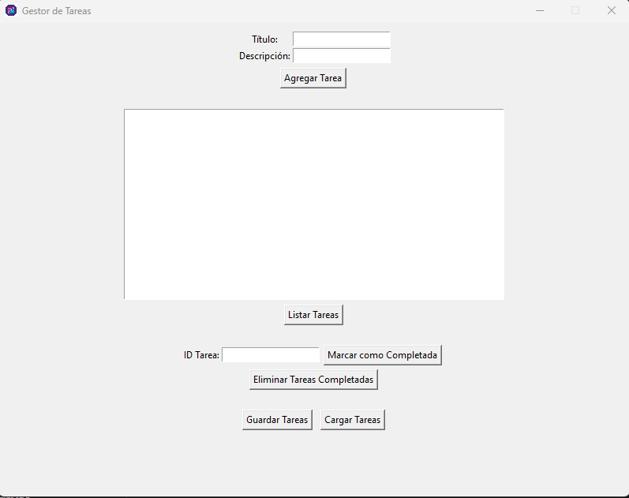
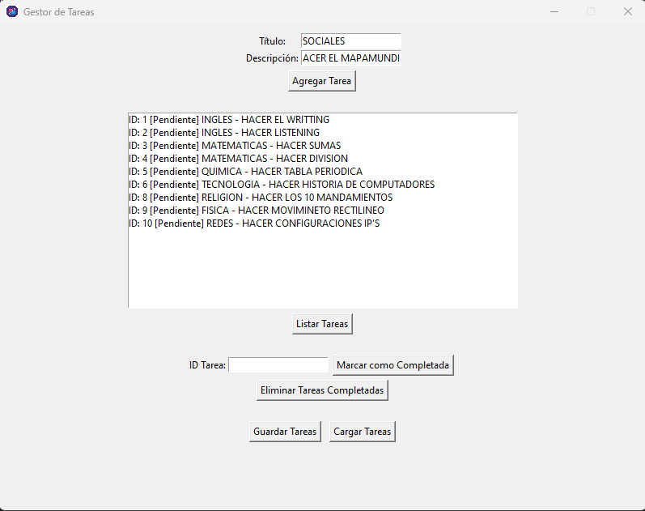
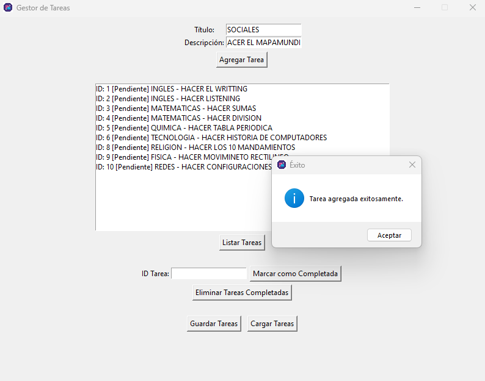
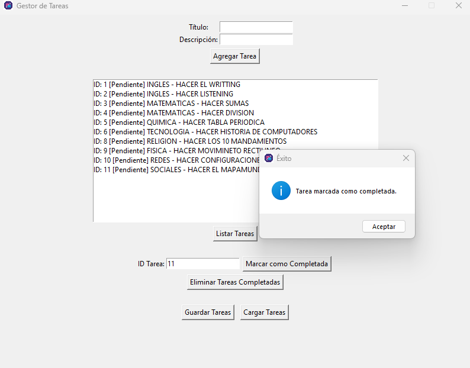
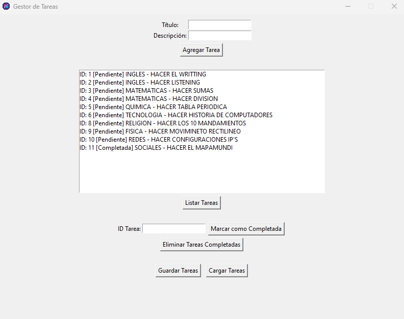
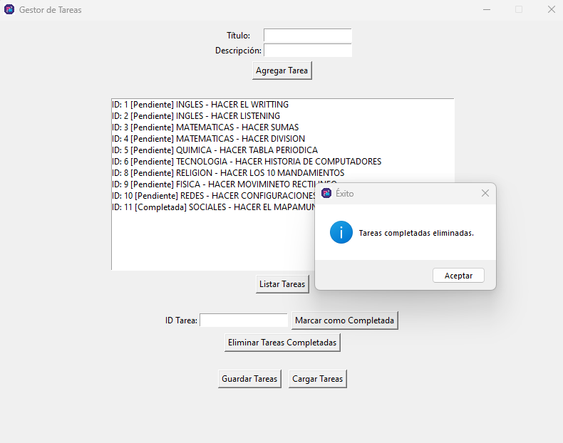
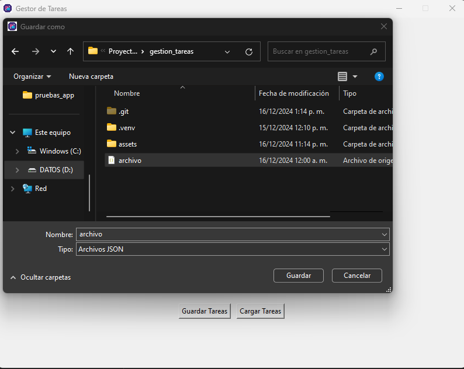
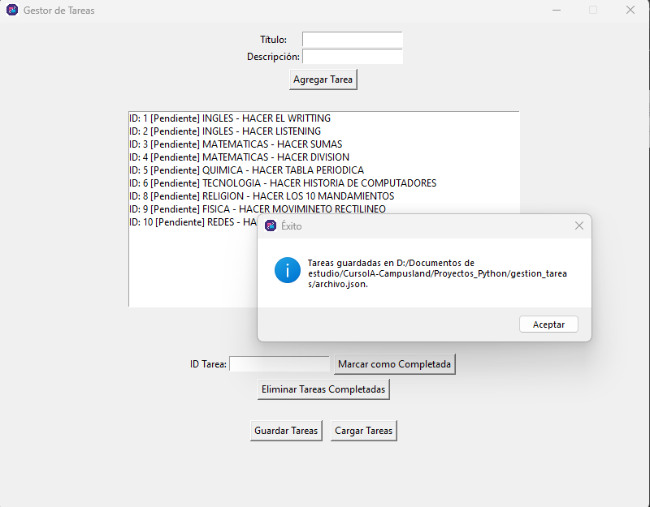
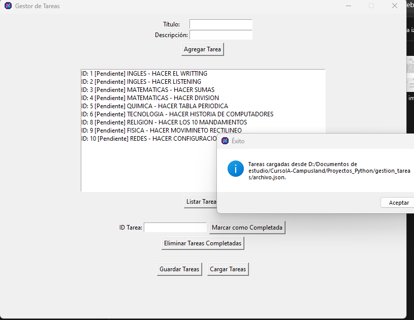

#   Gestión de tareas

##  Descripción
Este es un proyecto de gestor de tareas, el cual brinda la funcionalidad de agregar tareas, marcar como completadas, eliminar las tareas completas, exportar a formato json o importar en formato json las tareas guardadas.
Cuenta con persistencia de datos por medio de la base de datos SQLite.  

## Instalación
1. clona el repositorio
   git clone https://github.com/carlosAtriana/GestionTareasApp.git

2. Ve al directorio:
    cd GestionTareasApp

##  Uso
1. Luego de estar dentro del directorio del proyecto (GestionTareasApp) ejecutas el siguiente comando:
    py gestion_tareas_app.py 
Aclaración: El comando py puede variar según como se tenga configurado en las variables de entorno, es decir, que si no funciona con py gestion_tareas_app.py funciona con python gestion_tareas_app.py

##  Autor
Carlos Alonso Triana Sepúlveda

##  Imágenes aplicación funcionando
Las capturas de imgenes de la aplicación funcionando se encuentran en la carpeta "assets/pruebas_app".

